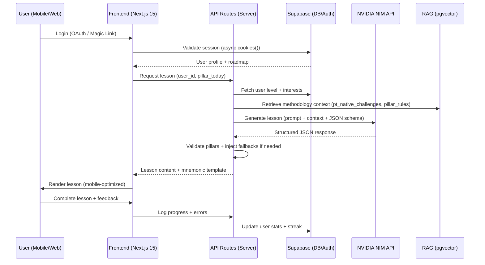

# Lexio System Architecture (MVP)

## Tech Stack

| Layer | Technology | Why |
|-------|-----------|-----|
| Frontend | **Next.js 15** (App Router) | Mobile + desktop, SSR for SEO, Vercel optimized |
| Backend | Next.js API Routes + Supabase Edge Functions | Serverless, unified codebase |
| Database | Supabase (PostgreSQL + pgvector) | Auth + DB + realtime, SA region support |
| Hosting | Vercel (`sao1` region) + Cloudflare (DNS/CDN) | Global edge, low latency for BR users |
| Auth | Supabase Auth (OAuth: Google/Apple + Magic Link) | Simple, secure, LGPD-compliant |
| Payments | Stripe | Same pattern as Liceu — reuse webhook handlers |
| Email | Resend | Transactional + streak re-engagement flows |
| AI | NVIDIA NIM API (Nemotron primary, Gemma fallback) | Free tier, strong reasoning, OpenAI-compatible |
| RAG | Supabase pgvector (BGE-m3 embeddings) | Leverages existing Supabase, free tier sufficient for MVP |

## Next.js 15 — Critical Patterns

> Do NOT use Next.js 14 patterns. Key changes in 15:

```typescript
// ✅ Next.js 15: params are async
export default async function LessonPage({
  params,
}: {
  params: Promise<{ lessonId: string }>;
}) {
  const { lessonId } = await params;
  // ...
}

// ✅ Next.js 15: cookies/headers are async
import { cookies } from "next/headers";

export async function GET() {
  const cookieStore = await cookies();
  const session = cookieStore.get("session");
  // ...
}

// ✅ Next.js 15: use cache directive
async function getLessonContent(userId: string) {
  "use cache";
  // fetch from Supabase — cached at edge
}

// ❌ DO NOT use getServerSideProps (Pages Router — not applicable here)
// ❌ DO NOT use synchronous params access
```

## Data Flow



## Fallback Strategy

```
1. Primary:    NVIDIA NIM (Nemotron-3 Nano)      — verify model ID at build.nvidia.com
2. Fallback 1: NVIDIA NIM (Gemma-7B)             — same API wrapper, simpler prompt
3. Fallback 2: Cached lessons (level+topic, 24h TTL) — serve pre-generated content
4. Fallback 3: Rule-based template engine (JS)   — minimal, no AI required
5. Fallback 4: Static "review mode"              — user re-reads past lessons
```

Auto-pause generation when credits exhausted. Email alert at 80%, 95%, 100% usage thresholds.

## Serverless Rationale

- Pay-per-use cost control (critical for MVP with free NVIDIA tier)
- Automatic scaling for beta growth without DevOps overhead
- Vercel + Supabase integration is seamless — same pattern as Liceu LMS
- Cloudflare handles DDoS, caching, and DNS without additional config

## Cron Jobs (Vercel)

```json
{
  "crons": [
    {
      "path": "/api/cron/reset-daily-lessons",
      "schedule": "0 0 * * *"
    },
    {
      "path": "/api/cron/send-streak-reminders",
      "schedule": "0 11 * * *"
    }
  ]
}
```

> Both crons run in UTC. `0 0 * * *` = midnight UTC = 21:00 BRT (UTC-3).
> Adjust to `0 3 * * *` for midnight BRT if needed.
