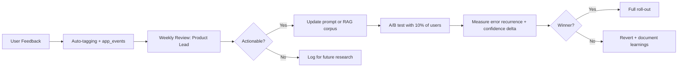

# Feedback Loop Specification

## User Feedback Collection

### In-Lesson (Post-Completion)

Shown immediately after lesson completes. Max 3 taps — never a full form.

```typescript
interface LessonFeedback {
  lesson_id: string;
  rating: 1 | 2 | 3 | 4 | 5;
  error_tags?: Array<
    | 'pt_interference'
    | 'grammar_confusion'
    | 'mnemonic_confusing'
    | 'mnemonic_helpful'
    | 'too_easy'
    | 'too_hard'
    | 'communication_irrelevant'
  >;
  notes?: string;           // Optional, max 280 chars
  would_recommend?: boolean;
}
```

Tag selection is shown as quick-tap chips, pre-filtered by which pillar was today's lesson.

### Leo Chat Feedback

- Thumbs up / thumbs down on each Leo response
- "Explain differently" button → logs `leo.explanation_rejected` event, triggers Leo to regenerate with a different angle
- Both signals feed into prompt quality monitoring at `/admin/prompt-issues`

## Auto-Tagging System (Rule-Based, MVP)

```typescript
function autoTagFeedback(
  notes: string | undefined,
  lessonContext: { pillar: string; difficulty: string }
): string[] {
  if (!notes) return [];
  const tags: string[] = [];
  const text = notes.toLowerCase();

  // PT interference mentions
  if (/portugu[eê]s|pt-br|brasile|traduz/.test(text)) {
    tags.push('pt_interference');
  }
  // Mnemonic feedback
  if (/memória|hook|palace|mnemonic|anchor/.test(text)) {
    tags.push('mnemonic_feedback');
  }
  // Difficulty signals
  if (/fácil|easy|óbvio|obvious/.test(text)) tags.push('too_easy');
  if (/difícil|hard|confus|não entend/.test(text)) tags.push('too_hard');
  // Pillar-specific clarity
  if (lessonContext.pillar === 'grammar' && /confus|unclear/.test(text)) {
    tags.push('grammar_clarity');
  }

  return tags;
}
```

## Weekly Review Process

Every Monday, product lead reviews `/admin/feedback`:

1. Filter: `rating ≤ 2` + last 7 days
2. Scan: auto-tags for clusters (e.g., 8× `mnemonic_confusing` this week)
3. Decide: actionable or log for future research
4. If actionable: create prompt revision + A/B test with 10% of users



## Closing the Loop with Users

When a cluster of similar feedback triggers a prompt change, send a closing email via Resend:

```text
Subject: You spoke, we listened

Hi {first_name or "there"},

Thanks for your feedback on the "{lesson_topic}" lesson last week.
We heard: "{anonymized_summary_of_complaint}"

What changed:
✅ Simpler memory palace hook structure
✅ More Brazilian cultural references in examples
✅ PT-BR contrast now appears in every grammar lesson

Try the updated lesson: [Start today's lesson →]

— Leo & the Lexio team
```

**Trigger conditions for this email:**
- Tag cluster: `mnemonic_confusing` ≥ 10 instances in 7 days → prompt change deployed
- Tag cluster: `pt_interference` rated ≤ 3 ≥ 8 instances → RAG corpus update deployed
- Only send to users who submitted feedback in that cluster (opt-in only)

## Spreadsheet Export

For manual analysis and sprint planning:

```bash
# Daily export (run from CI or admin panel)
npm run export:feedback -- --date=$(date +%Y-%m-%d) --format=csv

# Output: feedback_YYYY-MM-DD.csv
# Columns: lesson_id, rating, error_tags, notes, pillar, difficulty, user_level
# Destination: Shared folder (no PII — user_id hashed)
```

Owner reviews every Monday. Input into weekly methodology sprint.
